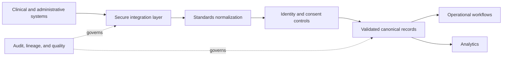

# Healthcare Integration

> Publication note: reorganized as an educational template. Employer-specific details are removed; all scenarios, metrics, and identifiers are fictionalized placeholders and are not claims about the maintainer's employment.

<!-- architecture-overview:start -->
## Architecture at a glance

### Interview framing

Use public interoperability concepts and synthetic examples. Address consent, minimum necessary access, identity resolution, provenance, and data quality.

> **Key trade-off:** Never place real patient data or protected health information in interview examples.
<!-- architecture-overview:end -->

Healthcare Data Engineering & Integrations

## Question 1:
## What is an EHR?

An Electronic Health Record (EHR) is the primary operational system used by
healthcare providers to manage patient information throughout the care lifecycle.

An EHR typically contains:
* Patient demographics
* Encounters
* Diagnoses
* Medications
* Allergies
* Lab results
* Clinical notes
* Procedures
* Orders
* Appointments

Unlike an analytics warehouse, an EHR is designed for day-to-day clinical operations.

Examples include:
* Epic
* Cerner (Oracle Health)
* athenahealth
* eClinicalWorks

Follow-up:

## Why integrate with an EHR?

Healthcare organizations rarely operate from a single system.
Analytics platforms, revenue cycle applications, AI models, reporting systems,
and operational dashboards all require access to clinical and operational data stored in EHRs.
Integrations ensure those downstream systems receive trusted, timely, and standardized information.

## Question 2:
## What's the difference between EHR and EMR?

EMR (Electronic Medical Record)
* Primarily used within a single healthcare organization.
* Focused on an individual provider or practice.

EHR (Electronic Health Record)
* Designed to support sharing information across organizations.
* More interoperable.
* Broader longitudinal patient view.

Today, most large healthcare organizations use modern EHR platforms.

## Question 3:
## What is FHIR?

FHIR (Fast Healthcare Interoperability Resources) is a modern interoperability standard
for exchanging healthcare information.

Instead of exchanging entire patient files, FHIR defines standardized resources such as:
* Patient
* Encounter
* Observation
* Practitioner
* Medication
* Appointment
* Claim

These resources are typically exchanged using REST APIs and JSON.
FHIR simplifies interoperability between healthcare systems.

Follow-up:

## Have you worked directly with FHIR?

I haven't implemented FHIR integrations directly, but I understand its role as the modern
interoperability standard for healthcare APIs. My experience has primarily focused on building
the downstream ingestion, governance, transformation, and analytics platforms that consume
standardized healthcare data.

## Question 4:
## What is HL7?

HL7 is an older healthcare messaging standard.

Unlike FHIR, HL7 commonly exchanges structured messages between healthcare systems.

Examples include:
* Patient admission
* Lab orders
* Discharge notifications

Many legacy hospital systems still rely on HL7 interfaces.

Modern architectures increasingly expose FHIR APIs while continuing to support HL7 for existing integrations.

## Question 5:
## What's the difference between HL7 and FHIR?

## Hl7
* Message-based
* Older standard
* Often transmitted over specialized interfaces
* Less developer-friendly

## Fhir
* Resource-based
* REST APIs
## * Json/Xml
* Easier integration
* Cloud-native

FHIR is generally preferred for new integrations.

## Question 6:
## What is a Patient Encounter?

An encounter represents a specific interaction between a patient and a healthcare provider.
Examples include:
* Office visit
* Emergency room visit
* Hospital admission
* Telehealth appointment

Each encounter typically contains:
* Patient
* Provider
* Date/time
* Diagnosis
* Procedures
* Notes
* Billing information

Encounters become one of the core facts within healthcare analytics platforms.

## Question 7:
## What is a Claim?

A claim represents a request for payment submitted by a healthcare provider to an insurance payer.

Claims generally include:
* Patient
* Provider
* Services performed
* Diagnosis codes
* Procedure codes
* Charges
* Payment information

Claims data is frequently used for reimbursement analysis, reporting, fraud detection, and operational analytics.

Use only claims experience that you are authorized to discuss; otherwise answer from public domain knowledge.

## Question 8:
## What is Eligibility?

Eligibility determines whether a patient has active insurance coverage and what benefits are available.

Eligibility data answers questions such as:
## * Is coverage active?
## * Which plan?
* Coverage dates
* Member identifiers
* Benefit information

Many downstream healthcare processes depend on accurate eligibility information before claims are processed.

## Question 9:
## What is Provider Data?

Provider data contains information about physicians, hospitals, clinics, and other healthcare professionals.

Examples include:
## * Npi
* Tax ID
* Specialty
* Practice location
* Organization hierarchy
* Network participation

Provider data is used for attribution, reimbursement, reporting, and operational analytics.

## Question 10:
## What makes healthcare data difficult?

Healthcare data is challenging because it combines technical complexity with regulatory requirements.

Some common challenges include:
* Multiple source systems
* Different standards (HL7, FHIR, proprietary)
* Schema evolution
* Patient identity resolution
* PHI protection
* Data quality issues
* Large data volumes
* Strict compliance requirements

Building reliable healthcare platforms requires both strong engineering practices and an
understanding of healthcare workflows.

## Question 11:
## What is Data Reconciliation?

Data reconciliation verifies that data moved correctly between systems.

Typical reconciliation checks include:
* Record counts
* Aggregate totals
* Duplicate detection
* Missing records
* Checksums
* Business-level validation

Reconciliation is critical for identifying silent data loss before downstream consumers are impacted.

## Question 12:
## What is a Data Contract?

A data contract is an agreement between data producers and data consumers that defines:
* Schema
* Required fields
* Data types
* Update frequency
* Ownership
* Quality expectations
* Backward compatibility rules

Data contracts reduce unexpected breaking changes and improve reliability across distributed systems.

## Question 13:
## How would you onboard a new hospital?

My process would be:
1. Understand business objectives.
2. Identify available integration methods (FHIR, HL7, APIs, batch).
3. Define the data contract.
4. Design ingestion into the Bronze layer.
5. Implement validation and reconciliation.
6. Standardize into the Silver layer.
7. Build business-ready Gold datasets.
8. Add monitoring, alerting, and SLA tracking.
9. Validate with stakeholders before production.

This combines technical execution with stakeholder collaboration.

## Question 14:
## How do you protect PHI?

Healthcare data requires multiple layers of protection.

I think in terms of defense in depth:

* Encryption at rest
* Encryption in transit
## * Rbac
* Dynamic masking
* Metadata-driven governance
* Audit logging
* Least-privilege access

At a fictionalized healthcare organization, I implemented a metadata-driven governance framework that
dynamically enforced encryption and masking policies based on user role and geography.

## Question 15:
## What excites you about healthcare?

I've spent most of my career building platforms that help healthcare organizations make better use of their data.
What excites me is that reliable healthcare data directly impacts operational efficiency,
reporting, reimbursement, and ultimately patient care.
As AI becomes more integrated into healthcare, trusted data platforms become even more important.

## Bonus: Questions You Should Ask the Hiring Manager

These leave a strong impression because they show you're already thinking like an owner:

1. How does Adonis currently integrate with customer EHRs? Is it primarily FHIR, HL7, or a mix?
## 2. What are the biggest technical challenges in onboarding a new health system today?
3. How standardized are your integration pipelines, and where do you still rely on custom implementations?
## 4. What does success look like for this role in the first six months?
## 5. What architectural improvements would you like the next senior engineer to help drive?
