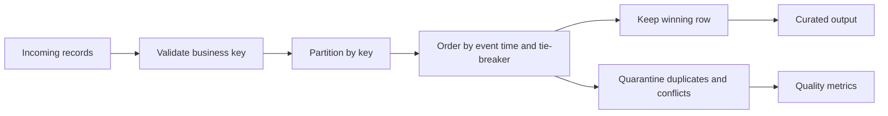

# Deduplication

> Publication note: reorganized as an educational template. Employer-specific details are removed; all scenarios, metrics, and identifiers are fictionalized placeholders and are not claims about the maintainer's employment.

<!-- architecture-overview:start -->
## Architecture at a glance

### Interview framing

Define the winner deterministically and retain enough evidence to explain discarded records.

> **Key trade-off:** A plain distinct operation is insufficient when duplicate rows disagree.
<!-- architecture-overview:end -->

CMS accidentally sends duplicates
How?

we use python set()

Spark: dropDuplicates()

## Sql: Row_Number() Qualify = 1

Delta: Merge

Spark waits.
Then closes the window.
This isn't a coding question.
It's a Spark concept.
