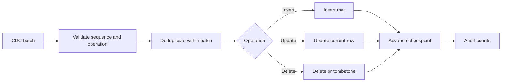

# Incremental Cdc

> Publication note: reorganized as an educational template. Employer-specific details are removed; all scenarios, metrics, and identifiers are fictionalized placeholders and are not claims about the maintainer's employment.

<!-- architecture-overview:start -->
## Architecture at a glance

### Interview framing

Apply changes idempotently and advance checkpoints only after a durable successful merge.

> **Key trade-off:** Handle deletes, replay, out-of-order changes, schema evolution, and partial failure explicitly.
<!-- architecture-overview:end -->

## How do you process 2 billion daily updates?

Never reload. Instead:

MERGE INTO patient
USING bronze
ON patient_id
## When Matched
## Update
## When Not Matched
## Insert

Algorithm: Merge Sorted Arrays + Hash Join + CDC
