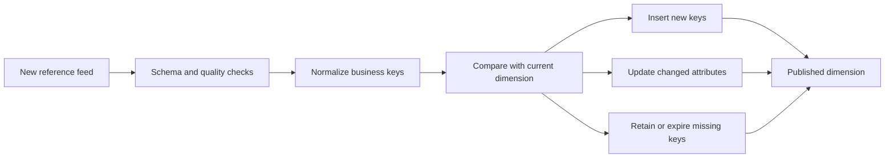

# Merge Reference Feed

> Publication note: reorganized as an educational template. Employer-specific details are removed; all scenarios, metrics, and identifiers are fictionalized placeholders and are not claims about the maintainer's employment.

<!-- architecture-overview:start -->
## Architecture at a glance

### Interview framing

Decide whether absence means deletion, late delivery, or no change before merging a reference feed.

> **Key trade-off:** State the slowly changing dimension policy and deterministic change-detection rule.
<!-- architecture-overview:end -->

Yesterday's provider master has 80 million NPIs.
Today CMS sends another sorted provider file.
Merge them efficiently.

Pattern: Merge Sorted Arrays (#88)

Yesterday Master:
100
105
110
120

Today's Feed
101
105
111
125

Use two pointers:
p1 -> Yesterday
p2 -> Today

If 100 < 101

Output: 100 MOVE p1

if 105==105
Updated existing provider
Move Both

If 111 < 120: Insert new provider
Move p2
