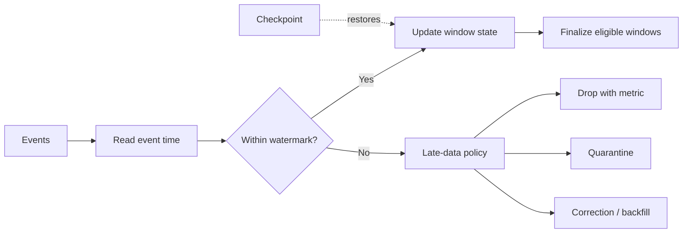

# Watermarks

> Publication note: reorganized as an educational template. Employer-specific details are removed; all scenarios, metrics, and identifiers are fictionalized placeholders and are not claims about the maintainer's employment.

<!-- architecture-overview:start -->
## Architecture at a glance

### Interview framing

Choose a watermark from observed lateness and business tolerance, not convenience.

> **Key trade-off:** Explain how finalized results are corrected when materially late data still arrives.
<!-- architecture-overview:end -->

Patient A arrives late:

10:05 -> 10:02

Do we discard? NO

Use: Watermark [illustrative scale]

Spark waits.
Then closes the window.
This isn't a coding question.
It's a Spark concept.
