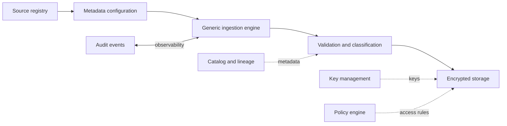

# Metadata And Encryption

> Publication note: reorganized as an educational template. Employer-specific details are removed; all scenarios, metrics, and identifiers are fictionalized placeholders and are not claims about the maintainer's employment.

<!-- architecture-overview:start -->
## Architecture at a glance

### Interview framing

Use metadata to configure repeatable ingestion, but validate configuration and isolate security policy from pipeline code.

> **Key trade-off:** A metadata-driven design still needs versioning, tests, safe rollout, and escape hatches.
<!-- architecture-overview:end -->

Metadata-Driven PHI Governance Framework

Instead of moving data, it governs how users can see sensitive data.
The metadata contains things like:

* Table name
* Column name
* Classification (PHI/PII)
* Encryption type
* Masking policy
* RBAC role
* Geography
* Whether offshore users are allowed
* Decryption policy
* Audit requirements

When a user queries Snowflake:
1. Snowflake checks the user's RBAC role.
2. Looks up the metadata.
3. Determines whether the user is allowed to see the value.
4. If authorized, the data is decrypted dynamically.
5. Otherwise, the value remains masked.

This is exactly why it saved licensing costs—you replaced manual/third-party governance
with a metadata-driven policy engine.

Business Problem

a fictionalized healthcare organization had a large offshore workforce supporting analytics, reporting, and operational activities.
The challenge was balancing two competing requirements:
* Make healthcare data accessible to authorized users.
* Ensure PHI/PII remained protected to satisfy HIPAA and internal security policies.

Previously, column-level permissions and masking rules were manually maintained
or handled by third-party tooling. That approach was difficult to scale and expensive.

My Solution:
I designed a metadata-driven governance framework.
Instead of hardcoding encryption or masking logic into every pipeline, we centralized governance in metadata.

For every sensitive column, the metadata stored information such as:
* Table name
* Column name
* PHI/PII classification
* Encryption type
* Masking policy
* Authorized RBAC roles
* Geographic restrictions
* Audit requirements

This separated governance policy from application logic.

Architecture:

               SQL Server / Source Systems
                         │
                         ▼
                Ingestion Pipeline
                         │
                 Encrypt PHI Columns
                         │
                         ▼
                 Snowflake Storage
                         │
             Metadata Governance Catalog
                         │
          ┌──────────────┴──────────────┐
          ▼                             ▼
   Authorized User               Unauthorized User
 (RBAC + Geography)            (RBAC Restricted)
          │                             │
          ▼                             ▼
 Dynamic Decryption              Dynamic Masking
          │                             │
          ▼                             ▼
   Query Result                  Masked Result

## Why Metadata?

Metadata allowed us to change governance policies without changing application code.
For example, if compliance introduced a new masking requirement or a geography restriction changed,
we only updated the metadata rather than modifying dozens of pipelines or SQL queries.
That made the system significantly easier to scale and maintain.

## Why Encrypt Instead of Just Mask?

Masking controls what a user sees, but encryption protects the data at rest.
We wanted defense in depth.
Even if someone accessed the underlying storage, sensitive values remained encrypted.
Only authorized users satisfying RBAC and geography policies could dynamically decrypt values at query time.

## How Did RBAC Work?

Every user belonged to one or more Snowflake roles.
When a query was executed, the governance framework evaluated the user's
RBAC role together with geography and the metadata associated with the requested columns.

If all policy requirements were satisfied, the framework dynamically decrypted the value before returning it.
Otherwise, the user received a masked value.

## What Happens When A New PHI Column Is Added?

The onboarding process included updating the metadata catalog with the new column's
classification and governance policy.
Once that metadata was added, the framework automatically enforced encryption, masking,
and RBAC rules without requiring application code changes.
