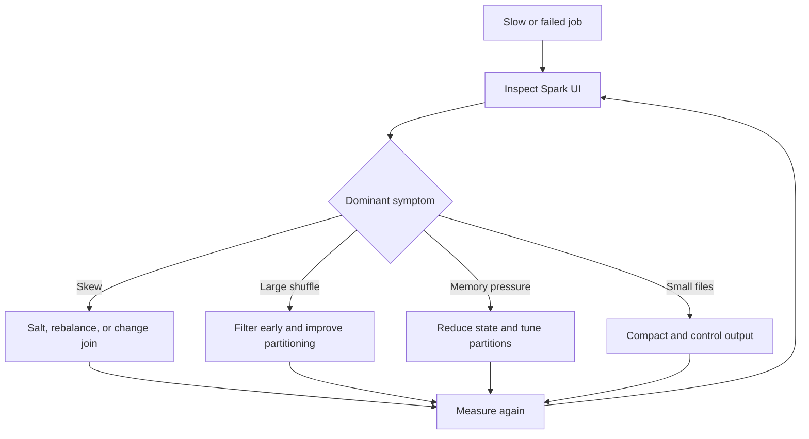

# Spark

> Publication note: reorganized as an educational template. Employer-specific details are removed; all scenarios, metrics, and identifiers are fictionalized placeholders and are not claims about the maintainer's employment.

<!-- architecture-overview:start -->
## Architecture at a glance

### Interview framing

Diagnose from stage and task metrics before tuning. Compare median and tail tasks, shuffle volume, spill, input size, and executor failures.

> **Key trade-off:** Every proposed optimization should name the observed bottleneck and expected metric change.
<!-- architecture-overview:end -->

## Question 1:
You mention processing 3 billion healthcare records every month. Why did you choose Spark instead
## of using Snowflake for everything?

At a fictionalized healthcare organization, Spark and Snowflake served different purposes within the platform.
Spark was our distributed compute engine for large-scale transformations during
ingestion and data standardization. It allowed us to efficiently process billions of
healthcare records, perform joins across very large datasets, apply business rules,
and optimize distributed execution.
Snowflake served as our analytical warehouse where curated datasets were consumed by
analytics, reporting, and downstream applications.
Processing everything directly inside Snowflake would have significantly increased
warehouse costs for heavy ETL workloads. Spark gave us better control over
distributed compute, while Snowflake provided excellent performance for analytics and governed data access.

We intentionally separated compute-intensive transformations from analytical consumption.

Follow-up:
## Why not only Spark?

Spark is excellent for distributed processing, but it isn't an analytical data warehouse.
Snowflake provides:
## * Rbac
* Governance
* Time Travel
* Secure data sharing
* SQL optimization
* Concurrent analytics

The combination allowed us to use the best tool for each responsibility.

## Question 2:
## Tell me about a Spark optimization you implemented?

One optimization involved a provider dataset that was taking significantly longer than expected.
After reviewing the Spark UI, I noticed excessive shuffle operations caused by joining
a very large fact table with several relatively small dimension tables.
Instead of allowing Spark to perform shuffle joins, I used broadcast joins for the smaller reference datasets.
I also reviewed partitioning strategy and enabled Adaptive Query Execution so
Spark could optimize execution plans dynamically.
These changes reduced shuffle volume, improved executor utilization, stabilized
runtime, and lowered overall compute costs.

Hiring Manager Follow-up:
## How did you know broadcasting was appropriate?

Because the reference datasets were relatively small and could comfortably fit into executor memory.
Broadcasting avoids shuffling the large dataset across the cluster.
Instead, Spark distributes the small dataset to every executor, allowing local joins.

## Question 3:
## Explain Adaptive Query Execution (AQE)?

Adaptive Query Execution allows Spark to modify the execution
plan during runtime rather than relying solely on compile-time estimates.

Examples include:
* Converting shuffle joins into broadcast joins
* Coalescing small partitions
* Handling skewed joins more efficiently

This improves performance because Spark makes decisions using actual runtime statistics instead of estimated values.

Interviewer
## Did you actually use AQE?

Yes. We enabled AQE as part of our Spark optimization strategy
because our healthcare workloads varied significantly in size depending on
the business cycle and source systems. It helped Spark automatically optimize
joins and partitioning without requiring manual tuning for every workload.

## Question 4:
## Explain Data Skew?

Data skew occurs when partitions are unevenly distributed.
Instead of every executor processing roughly the same amount of data,
one or two executors receive disproportionately larger partitions.
Those executors become bottlenecks while the rest of the cluster remains idle.

## How did you detect it?
Spark UI.
Stages with:
* Long-running tasks
* Uneven executor utilization
* Large shuffle reads
* One executor significantly slower than others

## How did you fix it?
Several approaches depending on the cause:
* Better partition keys
* Salting skewed keys
* Broadcast joins
* AQE skew handling
* Repartitioning before joins

## Question 5:
## Why Partition Data?

Partitioning reduces the amount of data Spark must scan.
Instead of reading an entire dataset, Spark only reads relevant partitions.
For healthcare datasets, common partition strategies included:
* Date
* Month
* Source system
* Business domain

Proper partitioning reduced I/O and improved execution time.

Follow-up:
## Too many partitions?

Small files.
Scheduling overhead.
Poor performance.

## Too few?
Poor parallelism.
Executors become overloaded.
Long runtimes.

## Question 6:
## Explain Caching?

Caching stores intermediate datasets in memory so they can be reused without recomputation.
I only cache data that:
* Is reused multiple times
* Is expensive to recompute
* Fits within available executor memory

Caching everything wastes memory and can actually reduce performance.

## Question 7:
Explain Narrow vs Wide Transformations.

Narrow:
No shuffle.
Examples:
* map
* filter
* union

Each partition can process independently.

Wide:
Shuffle required.
Examples:
* groupBy
* join
* distinct
* orderBy

These operations are generally more expensive because data moves across the cluster.

## Question 8:
## Walk me through how you debug a slow Spark job?

I follow a structured process.
First:
Review Spark UI.
Understand where time is spent.

Second:
Check execution plan.
Look for:
* Shuffle-heavy stages
* Skewed joins
* Large scans

Third:
Review data.

Questions:
## Has volume increased?
## Did schema change?
## Are new business rules creating more work?

Fourth:
Review cluster configuration.
Executors
Memory
Cores
Dynamic allocation

Fifth:
Optimize.
Possible improvements include:
* Better partitioning
* Broadcast joins
## * Aqe
* Predicate pushdown
* Removing unnecessary transformations

I always measure improvements before and after implementation.

## Question 9:
## Explain Predicate Pushdown?

Predicate pushdown pushes filter conditions closer to the data source.
Instead of loading an entire dataset into Spark and filtering afterward,
the storage engine only returns matching records.

Benefits include:
* Less I/O
* Lower network traffic
* Faster execution

## Question 10:
## How do you optimize Snowflake?

Optimization depends on workload.
Typical improvements include:
* Appropriate warehouse sizing
* Auto suspend and auto resume
* Clustering large tables
* Query optimization
* Partition pruning
* Materialized views where appropriate
* Avoiding unnecessary warehouse usage

I also monitor query history to identify long-running queries and opportunities for optimization.

## Question 11:
## Why Medallion?

Hiring Manager:
## Why not just one table?

Each layer serves a different purpose.
Bronze preserves source fidelity.
Silver standardizes data and performs quality enforcement.
Gold contains business-ready models.
Separating concerns improves traceability, governance, reprocessing,
debugging, and reuse across multiple business teams.

## Question 12:
## Why Metadata Driven?

Metadata-driven systems reduce hardcoded logic.
Instead of writing new code for every source or policy, behavior is controlled through configuration.
Benefits include:
* Faster onboarding
* Easier maintenance
* Greater consistency
* Better scalability
* Lower operational overhead

It's especially valuable in healthcare, where new datasets,
compliance rules, and integration requirements change frequently.
