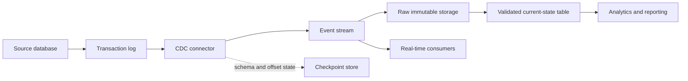

# Cdc And Change Data Capture

> Publication note: reformatted from private study notes. Employer-specific personal details and confidential context have been removed or generalized.

<!-- architecture-overview:start -->
## Architecture at a glance

### Interview framing

Use log-based CDC when low source impact and ordered changes matter. Discuss deletes, schema evolution, replay, idempotency, ordering, and checkpoint recovery.

> **Key trade-off:** At-least-once delivery requires idempotent consumers; exactly-once claims must define the boundary precisely.
<!-- architecture-overview:end -->

Design a CDC (Change Data Capture) Pipeline

Think:
SQL Server
Oracle
Postgres

changes need to reach:
Snowflake
Databricks
Data Lake

High-Level Design
Source DB
    │
    ▼
Debezium
    │
    ▼
Kafka
    │
    ▼
Spark Streaming
    │
    ▼
Data Lake
    │
    ▼
Snowflake

Suppose a customer updates:
customer_id = 123
name = John

to

customer_id = 123
name = Johnny

I would capture only the changed record/event instead of re-reading the entire customer table.
CDC reduces load on the source database, lowers latency, and allows downstream systems like Kafka, Spark,
and Snowflake to process incremental changes efficiently.

Key Memory:
Full load = entire table
CDC = inserts/updates/deletes only

Source DB
  ↓
Transaction Log / Binlog
  ↓
CDC Tool: Debezium / GoldenGate / Fivetran / DMS
  ↓
Kafka Topic
  ↓
Stream Processor: Spark / Flink
  ↓
Bronze Table
  ↓
Silver Table
  ↓
Gold / Snowflake / Analytics

I would capture source changes from transaction logs, land raw events in Bronze for audit and replay,
process them into Silver using primary keys and event timestamps, handle inserts, updates,
and deletes explicitly, then publish curated Gold datasets for reporting or downstream apps.
I'd also include schema drift detection, deduplication using event IDs, and reconciliation checks against the source.

Common failure cases:
Duplicate CDC events → dedupe by event_id / transaction_id
Out-of-order events → order by event_time / log sequence number
Schema drift → classify additive vs breaking
Kafka lag → scale consumers / partitions
Bad records → quarantine table
