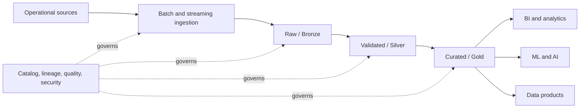

# Data Platform

> Publication note: reformatted from private study notes. Employer-specific personal details and confidential context have been removed or generalized.

<!-- architecture-overview:start -->
## Architecture at a glance

### Interview framing

Separate immutable ingestion, validated canonical data, and consumer-oriented products. Make ownership, contracts, lineage, quality gates, and recovery explicit.

> **Key trade-off:** Layer names are less important than clear responsibilities and enforceable interfaces.
<!-- architecture-overview:end -->

Design a Data Platform for IBKR

Requirements:
Trade Data
Account Data
Market Data
Research Data

Batch + Streaming

Historical Analytics
Real-Time Dashboards
GenAI Applications

Step 1: Requirements
## How much data?
## Latency requirements?
## Streaming or batch?
## Retention period?
## Compliance requirements?

Assumptions:
10 TB/day
Millions of market events/sec
Near real-time dashboards
7+ years retention

Step 2: Lakehouse Architecture
Sources
 │
 ├── Trading DB
 ├── Market Data
## ├── Crm
 ├── Research Docs
 │
 ▼
Ingestion Layer
 │
 ├── Kafka
## ├── Cdc
 ├── Batch Loads
 │
 ▼
Data Lake
## (S3 / Adls)
 │
 ▼
Bronze
 │
 ▼
Silver
 │
 ▼
Gold
 │
 ├── Snowflake
## ├── Bi
## ├── Ml
 └── GenAI

Medallion:
I wouldn't load directly into Gold because we need separation of concerns.
Bronze gives us raw replayable data for audit and recovery. Silver applies cleaning, deduplication,
schema standardization, and data quality checks. Gold creates business-ready datasets for reporting, ML, and GenAI.
This design makes backfills, debugging, lineage, and governance much easier.

Bronze = raw truth
Silver = cleaned truth
Gold = business truth

Auditability
Replayability
Data lineage
Regulatory retention
Controlled transformations
Clear ownership
