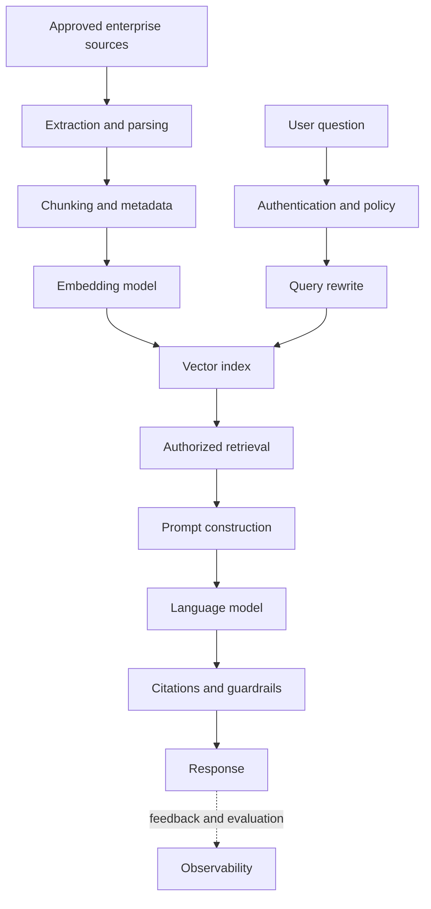

# Enterprise Rag And GenAI

> Publication note: reformatted from private study notes. Employer-specific personal details and confidential context have been removed or generalized.

<!-- architecture-overview:start -->
## Architecture at a glance

### Interview framing

A production RAG design must cover authorization before retrieval, source freshness, citations, evaluation, prompt-injection defense, latency, and cost.

> **Key trade-off:** Retrieval quality and access control usually matter more than model size.
<!-- architecture-overview:end -->

Design enterprise chatbot
Reduce hallucinations
RAG architecture
Vector DB
Embedding pipeline
Prompt management
Evaluation

Tell me about your most complex Spark pipeline
Tell me about a production issue
Tell me about a Snowflake optimization
Tell me about schema evolution
Tell me about handling billions of rows
Tell me about Kafka/Spark architecture you've built

Solutions:

1. Document ingestion pipeline
2. Embedding + vector database
3. RAG/LLM service

High Level Desing:
Internal Docs / PDFs / Wikis / Research Reports
        ↓
Document Ingestion
        ↓
Chunking + Metadata Extraction
        ↓
Embedding Model
        ↓
Vector DB
        ↓

User Question
        ↓
Auth / Permission Check
        ↓
Query Embedding
        ↓
Vector Search
        ↓
Retrieved Chunks
        ↓
Prompt Builder
        ↓
## Llm
        ↓
Answer + Citations

IBKR Specific points:

Access control: user should only retrieve documents they are allowed to see
Citations: answer should show source documents
Audit logs: log question, retrieved docs, model response
Hallucination control: answer only from retrieved context
Freshness: re-index docs when policies/reports change
Evaluation: track answer quality, retrieval precision, latency

I would not let the LLM answer directly from its pretrained knowledge.
I would build a RAG pipeline where internal documents are ingested, chunked, embedded,
and stored in a vector database. At query time, I retrieve permission-filtered relevant chunks,
pass them with the question to the LLM, and return an answer with citations and audit logging.

## Why do we need metadata on each chunk?
document_id
department
created_at
access_level
source_url
version

Metadata helps with:
Deduplication
Filtering
Access control
Freshness
Citations
Versioning

For IBKR, the biggest one is permission filtering.
example:
User A can access compliance docs
User B can access only public research docs

Each chunk should store metadata like:
document_id
department
created_at
access_level
source_url
version

then retrieval becomes:
Find similar chunks
AND user has permission
AND latest version only

Metadata lets us filter retrieval by permissions, department, document type, version, date, and source.
It also helps deduplicate documents, return citations, support audits, and avoid using outdated information.
For financial institutions, access control and traceability are critical.
