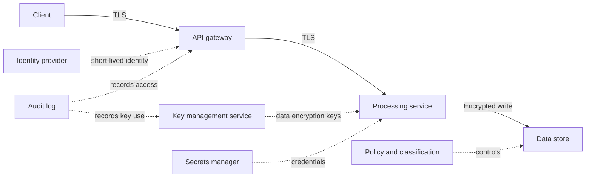

# Healthcare Encryption Framework

> Publication note: reformatted from private study notes. Employer-specific personal details and confidential context have been removed or generalized.

<!-- architecture-overview:start -->
## Architecture at a glance

### Interview framing

Explain encryption in transit, at rest, and at field level alongside identity, key rotation, least privilege, auditability, retention, and incident response.

> **Key trade-off:** Encryption does not replace authorization, data minimization, or monitoring.
<!-- architecture-overview:end -->

A. HIPAA Encryption Framework

Structure:
1. Problem
2. Scale
3. Architecture
4. Challenge
5. Solution
6. Result

Example

Problem:
We needed to encrypt sensitive PHI fields across multiple healthcare datasets while
maintaining query performance and supporting different downstream consumers.

Scale:
The largest dataset contained approximately 18 billion records and over 120 columns.

Architecture:
## Adf
 ↓
Spark
 ↓
Metadata Framework
 ↓
Encryption Engine
 ↓
Snowflake

Challenge:
Encrypting every column increased runtime significantly and many datasets required different encryption rules.

Solution:
I designed a metadata-driven encryption framework where datasets and columns were configured
through metadata tables. Spark dynamically applied encryption only to designated fields,
allowing us to reuse the framework across pipelines.

Result:
Reduced manual development effort, standardized PHI handling, improved governance,
and supported multiple pipelines with a single reusable framework.

B. Production Incident Question

Tell me about a production issue you solved.

Problem:
Pipeline normally 20 minutes
Suddenly 2 hours

Spark UI
↓
Found skew
↓
Large join
↓
Broadcast join
↓
Repartitioning
↓
Reduced runtime

C. Tell me about a time you disagreed with a design decision.

## D. How do you determine Azure cost?
I break costs down by service and workload. I look at compute, storage, networking, orchestration, and monitoring separately.
Then I identify the highest cost drivers and optimize utilization.

Example

Suppose architecture:
## Adf
 ↓
Databricks
 ↓
## Adls
 ↓
Snowflake

Cost Categories:
ADF Pipeline Runs
Databricks Compute
ADLS Storage
Network Egress
Snowflake Warehouse
Monitoring/Logs

Databricks Cost
The biggest cost driver is usually:

## Cluster size?
## Node type?
## Runtime hours?
## Autoscaling enabled?
## Job cluster or all-purpose cluster?

Optimize:
Autoscaling
Job clusters
Cluster auto-termination
Spot instances
Better partitioning
Reduce runtime

I first identify which service is driving cost. In most data platforms, compute is the largest contributor,
especially Databricks and Snowflake. I review utilization metrics, cluster sizing, runtime duration,
storage growth, data movement, and concurrency. Then I optimize based on the bottleneck rather than reducing resources blindly.

## Why Databricks when it's expensive?

Cost alone is not the decision criteria. I compare total cost versus productivity, scalability,
operational overhead, performance, and business value.

Databricks may have a higher infrastructure cost, but in many cases it reduces overall
engineering and operational cost. Faster development, managed infrastructure, autoscaling,
optimized Spark execution, governance features, and lower maintenance effort can justify the additional platform cost.

## Okay, if Databricks is expensive, when would you NOT use it?
If the workload is simple batch ETL, small datasets, predictable workloads, and doesn't require Spark-scale processing,
I would consider alternatives such as Azure Data Factory, Azure Functions, Synapse, Snowflake-native transformations,
or even SQL-based solutions. I don't use Databricks unless distributed processing provides meaningful value.

You have a 20 GB dataset.
## Would you use Databricks?
Dataset size alone is not enough information. For a 20 GB dataset, I would first evaluate transformation complexity,
processing frequency, latency requirements, scalability expectations, and operational overhead. If the workload can be
handled efficiently with SQL, Snowflake, or ADF, I would avoid introducing Databricks. I use Databricks when distributed
processing provides clear value.

E. Interview Question
## Databricks cost doubled last week. How do you investigate?
First, I would determine whether the cost increase is due to higher resource consumption or a pricing/configuration change.
I would start by checking Databricks cluster metrics and Spark UI to identify whether runtime increased, cluster size increased,
or additional jobs started running.

Then I'dd investigate in this order:
1. Data Growth
## Did source volume increase?
## Did a new source get onboarded?
## Did duplicates enter the pipeline?
## Did retention logic fail?

2. Spark Performance
Check Spark UI:
Slow stages
Shuffle size
Task duration
Disk spills
Skew

3. Schema Changes
## New columns?
## Complex nested structures?
## Data type changes?

4. Cluster Utilization
Executor utilization
Autoscaling behavior
Idle time
DBU consumption
Cluster uptime

5. Storage and Data Movement
Small file explosion
Excessive writes
Cross-region traffic
Repeated full reloads

F. Nodes/costs

I wouldn't assume either option is cheaper. First, I'd analyze the workload characteristics, data volume,
transformation complexity, and SLA requirements. A small cluster running for 10 hours may actually cost more than
a larger cluster running for 1 hour if the total compute consumption is higher.

I would compare total compute consumption, runtime, SLA requirements, cluster utilization, and
engineering productivity before deciding. The goal is not the smallest cluster or the biggest cluster; it's
the most cost-efficient architecture that meets business requirements.

## G.
## Why Databricks instead of just Snowflake SQL?

I choose Databricks when I need large-scale distributed processing, complex transformations, streaming workloads,
ML pipelines, or Spark-specific optimizations. Databricks provides native Spark execution, autoscaling, workflow orchestration,
monitoring, Spark UI visibility, and fine-grained control over execution plans. If the workload is mostly SQL-based analytics and
transformations, I would strongly consider Snowflake because it is simpler to operate and often more cost-effective.

The choice depends on the workload. For complex ETL, large joins, streaming pipelines, machine learning,
CDC processing, and custom transformations, Databricks gives me more flexibility and control. For analytical
SQL workloads, reporting, and warehousing, Snowflake is often the better choice. I don't choose Databricks because
it's Spark; I choose it when the workload justifies distributed processing and engineering flexibility.
