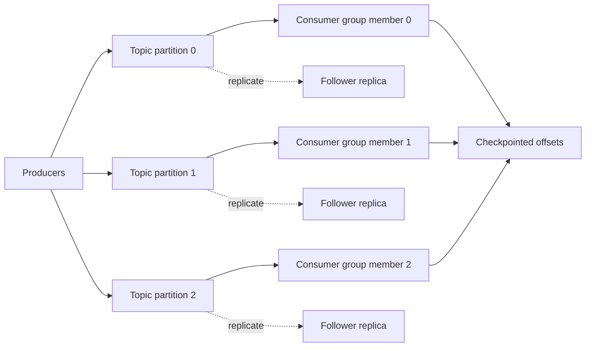

# Kafka Deep Dive

> Publication note: reformatted from private study notes. Employer-specific personal details and confidential context have been removed or generalized.

<!-- architecture-overview:start -->
## Architecture at a glance

### Interview framing

Partition keys control ordering and data distribution. Consumer-group parallelism is bounded by partition count; replication provides availability, not consumer parallelism.

> **Key trade-off:** Discuss skew, rebalancing, retention, replay, idempotency, delivery semantics, and dead-letter handling.
<!-- architecture-overview:end -->

## What is a Kafka Partition?

Think of:
Topic = Database Table
Partition = Shard

Example:
Topic: trades

Partition 0
Partition 1
Partition 2
Partition 3

Messages:
Partition 0:
offset 0
offset 1
offset 2

Partition 1:
offset 0
offset 1
offset 2

## Why partitions exist?
without partitions:
1 consumer
1 machine

With partitions:
Partition 0 → Consumer 1
Partition 1 → Consumer 2
Partition 2 → Consumer 3
Partition 3 → Consumer 4

Parallel Processing

Kafka Interview Rule
Max parallelism in a consumer group
=
Number of partitions

## Question 2 — Replication Factor

Suppose:

Topic: trades

Partition 0
Replication Factor = 3
Kafka stores:
Broker 1
Broker 2
Broker 3

why?
High Availability
Fault Tolerance

example:
Broker 1 = Leader

Broker 2 = Follower
Broker 3 = Follower

Producer
 ↓
Leader
 ↓
Followers replicate

## What is ISR?

In-Sync Replicas

ISR stands for In-Sync Replicas. These are replicas that are fully caught up with the leader.
If the leader fails, Kafka elects a new leader from the ISR set to minimize the risk of data loss

For financial systems I generally prefer at-least-once delivery with idempotent consumers.
Losing a trade, payment, CDC event, or fraud event is usually worse than receiving a duplicate.
Duplicates can be safely handled using transaction IDs, idempotency keys, unique constraints, or deduplication logic.
