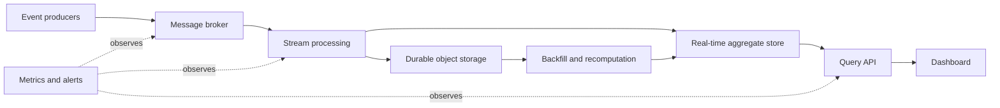

# Real Time Dashboard

> Publication note: reformatted from private study notes. Employer-specific personal details and confidential context have been removed or generalized.

<!-- architecture-overview:start -->
## Architecture at a glance

### Interview framing

Precompute bounded aggregates for predictable latency, retain raw events for replay, and define freshness and correctness service levels.

> **Key trade-off:** Separate event-time correctness from dashboard refresh frequency.
<!-- architecture-overview:end -->

Real-Time Dashboard Design

IBKR wants a dashboard showing:
- latest trades
- order volume
- account activity
- market prices
- alerts

Requirement:
Dashboard refresh < 1 second
Historical analytics also needed

Architecture:
Event Sources
  ↓
Kafka
  ↓
Stream Processor: Flink / Spark Streaming
  ↓
Redis / Pinot / Druid
  ↓
API / WebSocket
  ↓
Dashboard

Also:
Kafka → Data Lake → Snowflake → Historical Analytics

Why not snowflake for live dashboard: latency
Snowflake is good for:
historical reporting
ad hoc analytics
audit
large aggregations

Data flow
1. Trade/order event lands in Kafka
2. Stream processor validates and enriches event
3. Aggregates are calculated in time windows
4. Latest metrics written to Redis/Pinot
5. API serves current metrics
6. WebSocket pushes updates to UI
7. Raw events also stored in lake/Snowflake for history

Important design choices
Kafka partitions by account_id or symbol
Stream processor handles windowed aggregations
Redis stores hot counters/latest values
Pinot/Druid stores real-time analytical slices
Snowflake stores long-term history
Dead-letter queue stores bad events
Monitoring tracks Kafka lag, processing latency, and dashboard freshness

I would separate the real-time serving path from the historical analytics path.
Redis or Pinot/Druid would support low-latency dashboard queries, while Snowflake/Data Lake
would support long-term analytics and audit workloads. This avoids putting sub-second dashboard traffic on Snowflake.

Bottlenecks + Failure Modes

This is where your system design answer becomes senior-level.

For the real-time dashboard: Kafka → Spark/Flink → Redis/Pinot → API/WebSocket → Dashboard

Bottleneck 1: Kafka lag

Problem:
Events arrive faster than consumers process them.
Dashboard becomes stale.

How to detect:
Consumer lag
Processing latency
Event-time vs processing-time delay

Fix:
Increase partitions
Add consumers
Optimize stream job
Reduce expensive joins/aggregations
Scale cluster

Bottleneck 2: Stream processor slow

Causes:
Data skew
Large stateful windows
Bad joins
Too much shuffle
Memory pressure

Fix:
Partition by correct key
Use broadcast joins for small dimensions
Tune window size
Use state TTL
Scale executors/task slots

Bottleneck 3: Redis hot keys

Example: One Redis key gets overloaded. (Everyone queries AAPL latest price.)
Fix:
Shard by symbol/category
Use read replicas
Cache at API layer
Use local in-memory cache for ultra-hot values

Bottleneck 4: API/WebSocket pressure
Problem: 100K users watching dashboard live.

Fix:
Load balancer
Horizontal API replicas
WebSocket gateway
Fanout service
Backpressure/rate limiting

Failure mode: bad events

Example:
Missing account_id
Invalid timestamp
Bad price
Schema mismatch

Fix:
Schema Registry
Validation layer
Dead-letter queue
Quarantine table
Alerting

Failure mode: duplicate events

Fix:
event_id
idempotent consumers
dedupe table/cache
exactly-once where possible

Failure mode: late/out-of-order events

Fix:
event_time processing
watermarks
allowed lateness
recompute affected windows

Interview-ready answer

I'd monitor Kafka lag, stream processing latency, Redis/Pinot query latency, API latency, and dashboard freshness.
For failures, I'd use schema validation, DLQ/quarantine, idempotent consumers,
event IDs for deduplication, and watermarks for late events. For bottlenecks,
I'd scale Kafka partitions/consumer groups, optimize stream jobs, handle skew, shard Redis, and horizontally scale APIs/WebSocket gateways.
