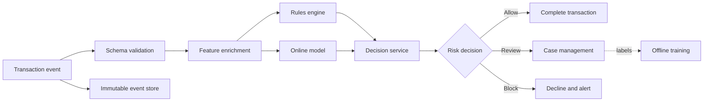

# Real Time Fraud Detection

> Publication note: reformatted from private study notes. Employer-specific personal details and confidential context have been removed or generalized.

<!-- architecture-overview:start -->
## Architecture at a glance

### Interview framing

Optimize the synchronous path for latency while preserving explainability, feature freshness, fallback behavior, and human review.

> **Key trade-off:** Discuss false positives, model drift, feedback delay, hot-key skew, and safe degradation.
<!-- architecture-overview:end -->

Design a Real-Time Fraud Detection System for credit card transactions.

Requirements:

Millions of transactions/day
Fraud decision < 100ms
Block suspicious transactions
Store transaction history
Allow model updates

Step 1: Requirements Gathering
What I would want to hear:

## Transaction volume?
## Latency SLA?
## False positive tolerance?
## Block or flag?
## Real-time or batch?
## Model-based or rule-based?

Assumptions:
## 10,000 Tps
Decision < 100ms
Must block fraudulent transactions
Need audit trail

Step 2: High-Level Architecture
Transaction
     │
     ▼
API Gateway
     │
     ▼
Kafka
     │
     ▼
Fraud Engine
     │
     ├── Rule Engine
     │
     ├── Feature Store
     │
     └── ML Model
     │
     ▼
Decision
     │
     ├── Approve
     └── Decline

So the Fraud Engine should read features like:
transactions_last_5_min
avg_spend_24h
merchant_risk_score
device_seen_before
country_mismatch

I would not query Snowflake in the real-time fraud path because it adds too much latency.
I'd use Redis or an online feature store for hot features,
while Snowflake/Data Lake stores historical transactions for offline analytics, model training, and audits.

Fraud Detection System - Deep Dive

Customer swipes card:
User
 ↓
Transaction API
 ↓
Fraud Engine
 ↓
Approve / Decline

First Naive Design
Transaction
 ↓
Database Query
 ↓
ML Model
 ↓
Decision

Problem:
Too many database calls
High latency
Not scalable

Better Design

Transaction
 ↓
Kafka
 ↓
Fraud Service
 ↓
Redis Feature Store
 ↓
Rules Engine
 ↓
ML Model
 ↓
Decision

Feature Store
Suppose transaction arrives:
{
  "user_id": "123",
  "amount": 5000,
  "merchant": "BestBuy",
  "country": "US"
}

Fraud Engine needs:
## How many transactions last hour?
## Average spend?
## Previous country?
## Previous merchant?

Don't calculate every time.

Store precomputed features:
user:123
---
txn_last_hour = 22
avg_spend = 80
last_country = CA
risk_score = 0.8

Rules Engine

Before ML.

Examples:
Amount > $10,000
## And
Country changed within 5 minutes

Immediately flag.

Reason:
Rules are fast
Explainable
Easy to audit

ML Model

Now use:
Transaction Features
+
User Features
+
Merchant Features

Output:
Fraud Probability = 0.92

Decision:
> 0.9 → Block
0.7-0.9 → Review
< 0.7 → Approve

Interviewer Follow-up

## Okay, Kafka is down. What happens?
## ASK: What are the business requirements?

Because there are two possible designs.

Option 1: Fail Closed

Financial institutions often prefer:
No fraud decision
=
No transaction approval
Transaction
 ↓
Kafka unavailable
 ↓
Reject / Retry
Fraud prevention > convenience

Option 2: Graceful Degradation

Some companies do:
Transaction
 ↓
Rules Engine Only
 ↓
Approve

while kafka is recovering

Availability > strict detection

## How would you prevent duplicate processing?

idempotency
unique transaction id
deduplication

transaction_id = T123
↓
## Check Redis/DB: already processed?
↓
If yes → return existing decision
If no → process fraud logic
↓
Store decision with transaction_id

I generally assume Kafka consumers are at-least-once, so I design consumers to be idempotent.
That is safer than relying only on exactly-once semantics.
