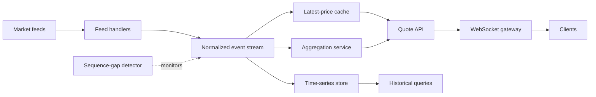

# Real Time Stock Prices

> Publication note: reformatted from private study notes. Employer-specific personal details and confidential context have been removed or generalized.

<!-- architecture-overview:start -->
## Architecture at a glance

### Interview framing

Preserve symbol ordering, detect sequence gaps, separate latest-value serving from historical storage, and apply client backpressure.

> **Key trade-off:** Market-data correctness requires explicit late, duplicate, and out-of-order event handling.
<!-- architecture-overview:end -->

Design a Real-Time Stock Price Analytics Platform

Step 1: Requirements
## What data sources?
## Real-time or batch?
## Expected latency?
## How many users?
## How much data?

Example Assumptions:

10 million stock ticks/sec
100,000 active users
Dashboard refresh < 1 second
Historical analytics required

Step 2: High-Level Architecture

Market Data Feed
        ↓
Kafka
        ↓
Stream Processing
        ↓
Storage
        ↓
## Api
        ↓
Dashboard

Visual:

Exchange Feeds
      │
      ▼
+-------------+
|    Kafka    |
+-------------+
      │
      ▼
+-------------+
| Spark/Flink |
+-------------+
      │
      ├────────► Redis
      │            │
      │            ▼
      │        Real-time API
      │
      ▼
+-------------+
| Data Lake   |
| S3 / ADLS   |
+-------------+
      │
      ▼
+-------------+
| Snowflake   |
+-------------+

## Why Kafka?
High throughput
Durable
Scalable
Decouples producers and consumers
Replay capability

## Why Spark Streaming / Flink?
Real-time aggregations
Windowing
Stateful processing
Event-time processing

## Why Redis?
User wants: Latest stock price now

Redis Stores:
Current price
Current volume
Current indicators

Latency: Milliseconds

## Why Snowflake?
Historical analysis
Reporting
Machine Learning
BI dashboards

## How would you add AI?

Market Data
      ↓
Kafka
      ↓
Feature Store
      ↓
LLM / Agent Layer
      ↓
Insights
Alerts
Recommendations

Examples:
Explain unusual volume
Summarize earnings impact
Generate market commentary

Use Redis for latest price because:
Redis = low-latency cache / key-value lookup
Snowflake = historical analytics / reporting

Typical design:
Market Feed → Kafka → Stream Processor → Redis → API → Dashboard
                                      ↓
                                  Snowflake

## If Kafka receives millions of ticks per second, how do we scale Kafka consumers?
## What concept lets multiple consumers process messages in parallel?

Partitions + Consumer Group
Example:
stock_ticks topic
Partition 0
Partition 1
Partition 2
Partition 3

Then one consumer group can process partitions in parallel:
Consumer 1 → Partition 0
Consumer 2 → Partition 1
Consumer 3 → Partition 2
Consumer 4 → Partition 3

Key Memory:
Kafka scale = partitions + consumer groups
API scale = load balancer + app replicas

Quick Mental Model
Web/API Scaling

Users
  │
  ▼
Load Balancer
  │
## ├── Api 1
## ├── Api 2
## ├── Api 3
