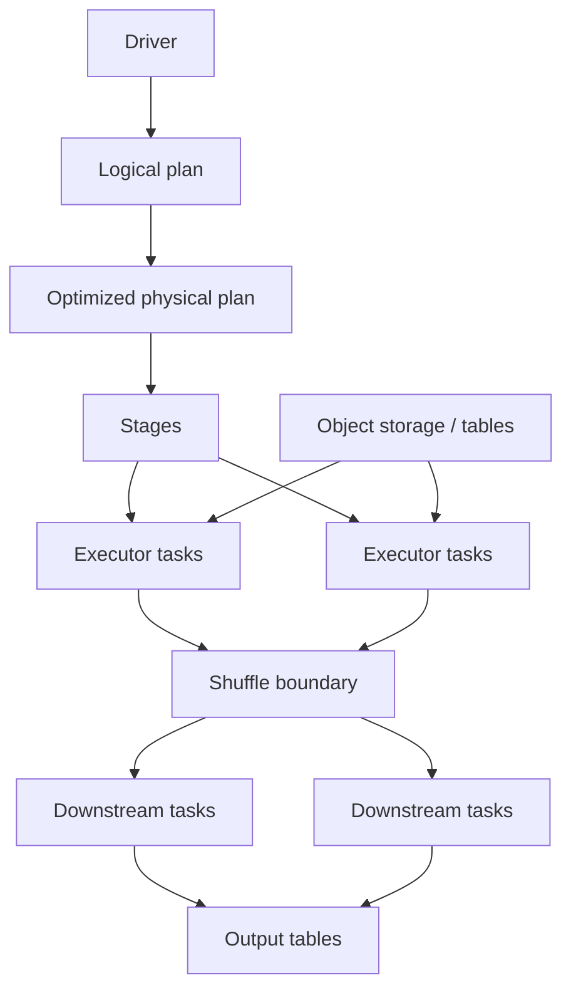

# Spark System Design

> Publication note: reformatted from private study notes. Employer-specific personal details and confidential context have been removed or generalized.

<!-- architecture-overview:start -->
## Architecture at a glance

### Interview framing

Reason from the physical plan: partitioning, shuffle, skew, joins, serialization, memory pressure, and small files determine performance.

> **Key trade-off:** Do not prescribe caching or repartitioning until the bottleneck is visible in the plan and metrics.
<!-- architecture-overview:end -->

Your Spark job used to finish in 20 minutes.

Today it's taking 2 hours.

Walk me through how you would troubleshoot it.

1. Spark UI
## 2. Dag
3. Stages
4. Shuffle
5. Skew
6. Executors
7. Storage
8. Input data changes

Step 1: Check Spark UI

## Which stage is slow?
## Which task is slow?
## Did runtime suddenly increase?
Jobs
Stages
Executors
SQL Tab

Step 2: Data Volume Change

## Did source data grow?
## New partitions?
## New columns?
## Unexpected duplicates?

Step 3: Shuffle

## What is a shuffle?
Answer:
A shuffle occurs when Spark needs to redistribute data across executors,
typically during joins, groupBy, distinct, repartition, or aggregations.

groupBy()
join()
distinct()
orderBy()

Step 4: Data Skew

customer_id
A → 1B rows
B → 10 rows
C → 20 rows

One task runs forever

How To Detect Data Skew

1. Task Duration (Biggest Clue)

Spark UI → Stages → Tasks

Suppose:
Task 1 = 10 sec
Task 2 = 12 sec
Task 3 = 9 sec
Task 4 = 8 sec
Task 5 = 45 min

One partition has way more data than the others.

2. Shuffle Read Size

Spark UI:
Task 1 = 100 MB
Task 2 = 120 MB
Task 3 = 90 MB
Task 4 = 80 MB
Task 5 = 80 GB

Skewed data above

3. Executor Metrics

You mentioned this.

Look for:
One executor:
## Cpu = 100%
Memory = very high
Spill to disk
Long runtime

Other executors:
Mostly idle

I would inspect Spark UI and compare task duration, shuffle read/write metrics, and executor utilization.
If one task is taking significantly longer or processing much more data than others, that's a strong indication of data skew.

## What's one technique you can use to reduce skew?
Repartitioning won't alone fix the issue. so we're going to use salting

Suppose you're joining:
Fact Table = 5 billion rows
Dimension Table = 10,000 rows
If one side of the join is small enough to fit in memory, I would use a broadcast join.
Spark distributes the smaller table to all executors, avoiding a costly shuffle of the large fact table.

Interviewer:

Your Spark job keeps spilling to disk.

## What does that usually tell you?
Common Causes:
Large shuffle
Data skew
Too few partitions
Huge groupBy / join
Executor memory too low
Bad partition sizing

Check:
Spark UI → Stages
Shuffle read/write
Memory spill / disk spill
Task duration
Skewed tasks
Executor memory usage

Fix:
Increase partitions if partitions are too large
Handle skew using salting
Use broadcast join for small dimension tables
Avoid unnecessary wide transformations
Filter early
Select only needed columns
Tune executor memory
Cache only reused data

Disk spill usually indicates memory pressure, often caused by large shuffles, skewed partitions,
or expensive joins/aggregations. I'd inspect Spark UI for spill metrics, shuffle size,
and long-running tasks, then optimize partitioning, joins, skew, and executor memory.

Interviewer:

## How would you optimize a Spark pipeline?

I first identify the bottleneck using Spark UI.
Then I look for expensive shuffles, skewed partitions, large joins, excessive data movement, and memory pressure.
I optimize by filtering early, selecting only required columns, using broadcast joins where appropriate,
tuning partition counts, handling skew, caching only reused datasets, and validating executor resource configuration.

## How do you manage a Spark pipeline with 100+ transformations?
Modularization
Data Quality
Testing
Observability
Lineage
Configuration Driven Logic

For large Spark pipelines, I break transformations into logical stages such as ingestion, cleansing, enrichment, business logic,
and output generation. This improves readability, testability, debugging, lineage tracking,
and allows teams to work independently on different layers.

## How do you test a Spark pipeline?

1. Unit Tests
Test individual transformations.

2. Data Quality Tests
Nulls
Duplicates
Invalid values
Schema changes
Referential integrity

3. Reconciliation
Between source and target:
Row Count
Sum Checks
Distinct Counts
Control Totals

4. End-to-End Tests

Suppose your source table yesterday had: 100 columns
Today is suddenly has 102 columns:
First I'll check whether source data has changed, whether new fields have been added, whether data types changed,
whether the ingestion framework can handle schema evolution, and whether any downstream transformations,
mappings, or data quality rules are affected.

I would have schema drift detection built into the ingestion framework.
When a schema change is detected, the pipeline compares the current schema against the expected schema,
classifies the change as additive or breaking, performs impact analysis, and either automatically
evolves the schema or stops execution and alerts the team. I would also maintain data quality gates
and reconciliation checks before publishing downstream datasets.

## How do you manage a Spark pipeline with tons of transformations?

I avoid writing one giant transformation chain. I break the pipeline into logical layers and
reusable functions so each step is testable, debuggable, and observable.

Raw / Bronze
  ↓
Clean / Silver
  ↓
Business Rules
  ↓
Gold / Serving

raw_df = read_source()

clean_df = clean_and_standardize(raw_df)

enriched_df = enrich_with_dimensions(clean_df)

business_df = apply_business_rules(enriched_df)

final_df = build_final_output(business_df)

Modular functions
Config-driven mappings
Intermediate checkpoints
Data quality gates
Logging and metrics
Lineage
Clear naming conventions
Reusable transformation libraries

For complex pipelines, I focus on maintainability as much as performance.
I separate ingestion, cleansing, enrichment, business logic, and serving layers.
That way, if something breaks, I can isolate the issue quickly instead of debugging a 500-line Spark chain.
