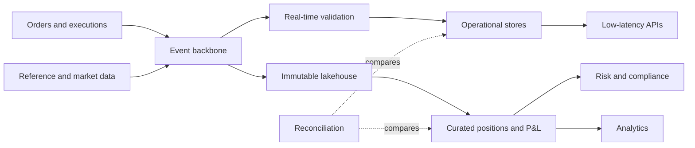

# Stock Trading Data Platform

> Publication note: reformatted from private study notes. Employer-specific personal details and confidential context have been removed or generalized.

<!-- architecture-overview:start -->
## Architecture at a glance

### Interview framing

Separate low-latency operational state from replayable analytical history, then reconcile them with stable event identifiers.

> **Key trade-off:** Ordering, auditability, corrections, market calendars, and deterministic replay are core requirements.
<!-- architecture-overview:end -->

Stock Trading / Market Data Platform

Requirements:
Functional:
- Users can view real-time quotes
- Users can place buy/sell orders
- System validates account, buying power, risk rules
- Orders route to broker/exchange
- Trades produce confirmations
- Historical trades and market data are queryable

Non-functional:
- Low latency
- High availability
- Auditability
- Idempotency
- Exactly-once or effectively-once processing
- Replayable event history
- Strong monitoring

High-level architecture:
Client App
   ↓
Load Balancer
   ↓
API Gateway
   ↓
Auth Service
   ↓
Order Service
   ↓
Risk / Buying Power Service
   ↓
Order Management System
   ↓
Exchange / Broker Router
   ↓
Execution Confirmation
   ↓
Kafka Events
   ↓
Ledger / Positions / Analytics / Audit

Market data side:
Exchange Market Feed
   ↓
Kafka Topic: market_ticks
   ↓
Flink / Spark Streaming
   ↓
Redis: latest price
   ↓
API / WebSocket
   ↓
User Dashboard

Also:
Kafka → Data Lake → Snowflake → Historical Analytics

Key tradeoffs:
Redis = latest price, low latency
Snowflake = history, reporting, compliance
Kafka = durable event backbone
Flink/Spark = streaming aggregation
WebSocket = push live prices to users

If interviewer asks “why Kafka?”:

Kafka decouples market-data producers from downstream consumers,
supports high-throughput ingestion, partitions for parallelism, stores events durably,
and allows replay for recovery, backfills, audits, or new consumers.

If interviewer asks “how do you scale?”:

API layer → load balancer + horizontal replicas
Kafka → partitions + consumer groups
Stream processing → more executors/task slots
Redis → cluster/sharding
Snowflake → warehouse scaling/clustering
Storage → partition by date/symbol

If interviewer asks “how do you avoid duplicate orders?”:
Client sends idempotency_key
Order Service checks if key already processed
If yes, return existing order response
If no, create order and persist event

Deep Dive: Stock Trading Order Flow

Think of this as two systems:
1. Market Data System
   Shows prices

2. Order Management System
   Places and tracks trades

Step 1: User submits order
{
  "user_id": "U123",
  "account_id": "A456",
  "symbol": "AAPL",
  "side": "BUY",
  "order_type": "LIMIT",
  "quantity": 100,
  "limit_price": 180,
  "idempotency_key": "abc-123"
}

## Why idempotency_key?
Because if the user clicks twice or network retries happen, we don't want two duplicate orders.

Step 2: API Gateway
Responsibilities:
Authentication
Rate limiting
Request validation
Routing to Order Service

Step 3: Order Service
Checks:
## Is request schema valid?
## Is symbol valid?
## Is account active?
## Is market open?
## Has this idempotency key already been used?

If duplicate key:
Return existing order response

Step 4: Risk / Buying Power Check
For BUY order:
Required cash = quantity x price

For example: 100 x 180 = 18,000

Check:
Available buying power >= 18,000
Margin rules
Position limits
Restricted symbols
Compliance rules

If fail: reject order

Step 5: Persist Order
Before sending to exchange, persist:
order_id
account_id
symbol
side
quantity
price
status = NEW
created_at
idempotency_key

Step 6: Publish Kafka Event
topic: order_events

event:
## Order_Created

Consumers:
Audit service
Notification service
Risk analytics
Position service
Monitoring

Step 7: Route to Exchange / Broker
Order Router decides:
## Which venue?
## Which broker connection?
## Which exchange?

Then sends order.

Status changes: NEW → SUBMITTED

Step 8: Execution Confirmation

Exchange responds:
Filled
Partially filled
Rejected
Canceled

Example:
## Order_Filled
quantity = 100
fill_price = 179.95

Now update:
Order status
Positions
Cash balance
Ledger
Trade history

Order State Machine

Very important interview concept:

## New
 ↓
## Validated
 ↓
## Submitted
 ↓
## Partially_Filled
 ↓
## Filled

## Rejected

## Canceled

## Expired

I would model the order lifecycle as a state machine so transitions are explicit, auditable, and easier to reason about.

Critical Design Concerns

1. Idempotency

Avoid duplicate orders.
idempotency_key + account_id
unique constraints

2. Auditability
Every event should be stored:
## Order_Created
## Order_Validated
## Order_Submitted
## Order_Filled
## Order_Rejected

3. Consistency

For account balance and positions:
Use transactional database / ledger model

Do not just overwrite balances casually.
Use append-only ledger events:
## Cash_Debit
## Security_Credit
## Commission_Charge

4. Replayability

Kafka helps replay events to rebuild:
Positions
Analytics
Risk metrics
Audit views

5. Latency

Use:
Redis for hot account/session/order status
Kafka for async events
OLTP DB for transactional order state
Snowflake for historical analytics

Interview Summary Answer

Say this:

I would separate market data from order management.
Market data would use Kafka, streaming processing, Redis, and WebSockets
for low-latency quote delivery. Order placement would go through API Gateway, Auth,
Order Service, Risk Check, Order Management, Broker Router, and Exchange.
Every state transition would be persisted and published as an event for audit,
positions, notifications, and analytics. I would use idempotency keys to prevent duplicate orders,
Kafka for durable event propagation, Redis for low-latency reads, and Snowflake/Data Lake for historical analytics.
